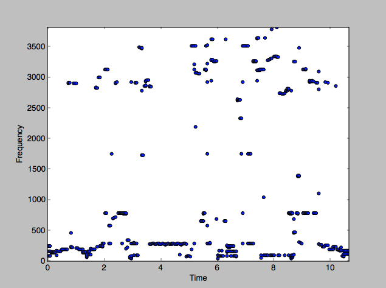

# SoundFound

Runs a fingerprinting algorithm on input music in order to determine the song name and the position in the song. Runs realFFT on each song with a window size of `4096` and a slide value of `2048`.

We generate a spectogram like this for each song:

### To run

First add MP3's to the folder `music/mp3`. Once you've done that run the script `convert.py` and make a `wav` folder to store the converted wav files.

	mkdir music/wav
	python3 convert.py

Then create your database of samples. This will put computed fingerprints in `database/songname.fp`.

	python3 createdb.py

Then run `find.py` to start classifying samples.

	python3 find.py

### Folder Structure
Assumes a structure of folders as follows:

	database/
		songname1.fp
		songname2.fp

	music/
		mp3/
			songname1.mp3
			songname2.mp3
		wav/
			songname1.wav
			songname2.wav

