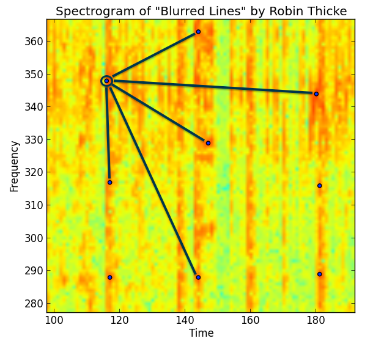

# SoundFound

Runs a fingerprinting algorithm on input music in order to determine the song name and the position in the song. 

### Methodology

I take each song that I'd like to add to the database and I run realFFT on each song with a window size of `4096` and a slide value of `2048`.

I generate a spectogram like this for each song:

I then store that spectrogram in a `songname.fp` file and I put it in my `database/` directory.

Once `createdb.py` is finished creating a directory of songs, I can run `find.py` which will record a several second snippet and store that audio in a file called `tmp.wav`. I then run `fingerprint.py` to generate the fp, though this time I don't store it in a file. 

Once I have both fingerprints, I run a function in `fingerprint.py`, `def match(fp1, fp2)`. This takes two fingerprints and sums the absolute difference between fingerprint 1 and fingerprint 2. See the code below for my simple difference function.

	def diff(l1, l2):
		sum = 0
		for i in range(len(l1)):
			r = min(len(l1[i]), len(l2[i]))
			for j in range(r):
				sum += abs(l1[i][j] - l2[i][j])
		return sum

I then iterate over the length of fingerprint 1, dragging fingureprint 2 across and computing the difference at each time step, then I append that to an array.

Once I've done the whole song, I take the smallest value in that array and computing the best match time by converting from the index of that sample into time. 

I repeat this process for every song until I have an array of (songname, difference_term, time) tuples. I then take the lowest tuple in that array and return that as the best match song to the user.

I'm going to implement constellation hashing similar to what Shazam does to speed up the search process.

### Results

I created a small test database of 8 songs and fed in 

| Song | Training Duration | Predicted Song | 
| --- | --- | --- |
| Alessia_Cara_-_Here.fp | 4 | Alessia_Cara_-_Here |
| Alesso_-_Heroes_(we_could_be).fp | 4 | Alesso_-_Heroes_(we_could_be)|
| Andy_Grammer_-_Honey,_I'm_Good..fp | 4 | Cage_The_Elephant_-_Back_Against_the_Wall |
| Big_Sean_-_I_Don't_Fuck_With_You.fp | 4 | Big_Sean_-_I_Don't_Fuck_With_You |
| Big_Wild_-_Aftergold.fp | 4 | Alessia_Cara_-_Here |
| Big_Wild_-_Aftergold_(feat._Tove_Styrke).fp | 4 | Alessia_Cara_-_Here |
| Cage_The_Elephant_-_Back_Against_the_Wall.fp | 4 | Cage_The_Elephant_-_Back_Against_the_Wall |
| Calvin_Harris_-_Outside.fp | 4 | Calvin_Harris_-_Outside |

### To run

First add MP3's to the folder `music/mp3`. Once you've done that run the script `convert.py` and make a `wav` folder to store the converted wav files.

	mkdir music/wav
	python3 convert.py

Then create your database of samples. This will put computed fingerprints in `database/songname.fp`.

	python3 createdb.py

Then run `find.py` to start classifying samples.

	python3 find.py

### Folder Structure
Assumes a structure of folders as follows:

	database/
		songname1.fp
		songname2.fp

	music/
		mp3/
			songname1.mp3
			songname2.mp3
		wav/
			songname1.wav
			songname2.wav

### References

* http://willdrevo.com/fingerprinting-and-audio-recognition-with-python/

* http://www.cs.bu.edu/~snyder/cs591/Lectures/FingerPrintingLecture2.pdf